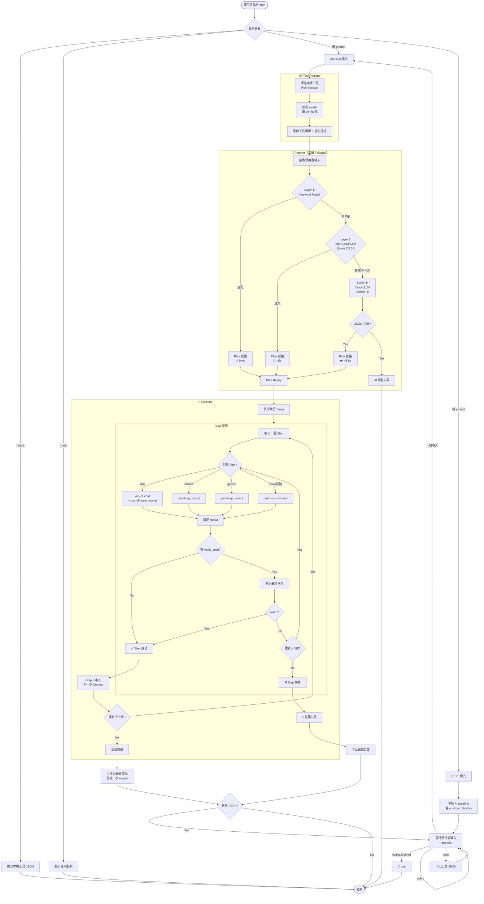
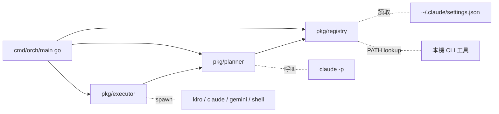
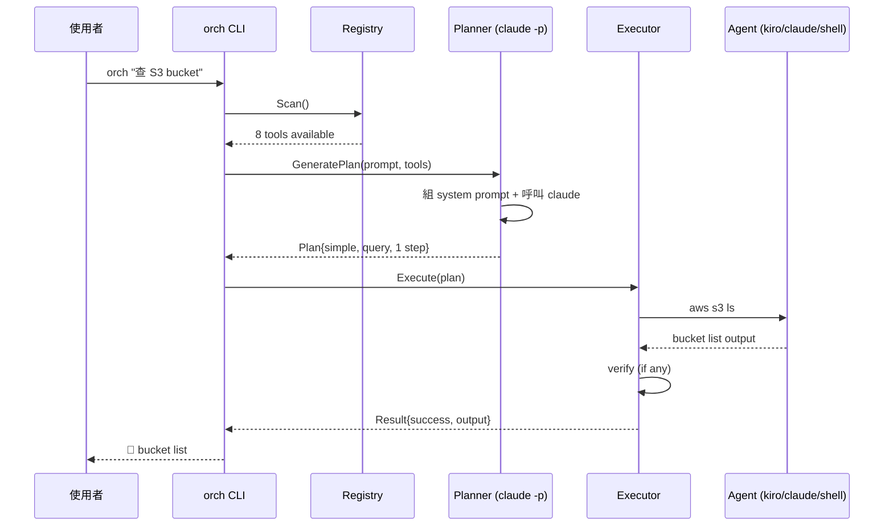

# Orch — Program Flow

## 整體架構流程圖

```mermaid
flowchart TD
    %% ===== 入口 =====
    Start([使用者執行 orch]) --> ArgParse{解析參數}
    
    ArgParse -->|--tools| ShowTools[顯示本機工具 JSON]
    ArgParse -->|--help| ShowHelp[顯示使用說明]
    ArgParse -->|帶 prompt| Oneshot[Oneshot 模式]
    ArgParse -->|無 prompt| REPL[REPL 模式]
    
    ShowTools --> End([結束])
    ShowHelp --> End

    %% ===== REPL 迴圈 =====
    REPL --> RLInit[初始化 readline<br/>載入 ~/.orch_history]
    RLInit --> RLWait[等待使用者輸入<br/>› prompt]
    RLWait -->|exit/quit/ctrl+d| Bye[👋 bye]
    RLWait -->|ctrl+c| RLWait
    RLWait -->|tools| ShowToolsInline[印出工具 JSON] --> RLWait
    RLWait -->|一般輸入| Oneshot
    Bye --> End

    %% ===== Oneshot 核心流程 =====
    Oneshot --> ScanReg

    subgraph Registry["📦 Tool Registry"]
        ScanReg[掃描本機工具<br/>PATH lookup] --> DetectModel[偵測 model<br/>讀 config 檔]
        DetectModel --> RegOut[產出工具清單 + 能力描述]
    end

    RegOut --> PlanPhase

    subgraph Planner["🧠 Planner（三層 Fallback）"]
        PlanPhase[接收使用者輸入] --> L1{Layer 1:<br/>Keyword Match}
        L1 -->|匹配| PlanReady[Plan 就緒<br/>⚡ 0ms]
        L1 -->|不匹配| L2{Layer 2:<br/>MLX Local LLM<br/>Qwen 2.5 3B}
        L2 -->|成功| PlanReady2[Plan 就緒<br/>🍎 ~5s]
        L2 -->|失敗/不可用| L3[Layer 3:<br/>Cloud LLM<br/>claude -p]
        L3 --> ValidatePlan{JSON 合法?}
        ValidatePlan -->|Yes| PlanReady3[Plan 就緒<br/>☁️ ~5-8s]
        ValidatePlan -->|No| PlanFail[❌ 規劃失敗]
        PlanReady2 --> ExecReady[Plan Ready]
        PlanReady --> ExecReady
        PlanReady3 --> ExecReady
    end

    PlanFail --> End
    ExecReady --> ExecPhase

    subgraph Executor["⚡ Executor"]
        ExecPhase[依序執行 Steps] --> StepLoop

        subgraph StepLoop["Step 迴圈"]
            direction TB
            NextStep[取下一個 Step] --> RouteAgent{判斷 Agent}
            RouteAgent -->|kiro| RunKiro[kiro-cli chat<br/>--trust-all-tools prompt]
            RouteAgent -->|claude| RunClaude[claude -p prompt]
            RouteAgent -->|gemini| RunGemini[gemini -p prompt]
            RouteAgent -->|shell/其他| RunShell[bash -c command]
            
            RunKiro --> Capture[捕捉 stdout]
            RunClaude --> Capture
            RunGemini --> Capture
            RunShell --> Capture
            
            Capture --> HasVerify{有 verify_cmd?}
            HasVerify -->|No| StepOK[✅ Step 成功]
            HasVerify -->|Yes| RunVerify[執行驗證指令]
            RunVerify --> VerifyResult{exit 0?}
            VerifyResult -->|Yes| StepOK
            VerifyResult -->|No| Retry{重試 ≤ 3次?}
            Retry -->|Yes| RouteAgent
            Retry -->|No| StepFail[❌ Step 失敗]
        end

        StepOK --> ChainCtx[Output 串入<br/>下一步 Context]
        ChainCtx --> MoreSteps{還有下一步?}
        MoreSteps -->|Yes| NextStep
        MoreSteps -->|No| AllDone[全部完成]
        StepFail --> TaskFail[💀 任務失敗]
    end

    %% ===== 結果 =====
    AllDone --> Report[🏁 印出最終成品<br/>最後一步 output]
    TaskFail --> ReportErr[印出錯誤位置]
    
    Report --> BackToREPL{來自 REPL?}
    ReportErr --> BackToREPL
    BackToREPL -->|Yes| RLWait
    BackToREPL -->|No| End
```

## 模組依賴關係

```mermaid
graph LR
    CMD[cmd/orch/main.go] --> REG[pkg/registry]
    CMD --> PLN[pkg/planner]
    CMD --> EXE[pkg/executor]
    PLN --> REG
    EXE --> PLN

    REG -.-|讀取| CONF[~/.claude/settings.json]
    REG -.-|PATH lookup| BIN[本機 CLI 工具]
    PLN -.-|呼叫| CLAUDE[claude -p]
    EXE -.-|spawn| AGENTS[kiro / claude / gemini / shell]
```

## 資料流

```mermaid
sequenceDiagram
    participant U as 使用者
    participant O as orch CLI
    participant R as Registry
    participant P as Planner (claude -p)
    participant E as Executor
    participant A as Agent (kiro/claude/shell)

    U->>O: orch "查 S3 bucket"
    O->>R: Scan()
    R-->>O: 8 tools available
    O->>P: GeneratePlan(prompt, tools)
    P->>P: 組 system prompt + 呼叫 claude
    P-->>O: Plan{simple, query, 1 step}
    O->>E: Execute(plan)
    E->>A: aws s3 ls
    A-->>E: bucket list output
    E->>E: verify (if any)
    E-->>O: Result{success, output}
    O-->>U: 🏁 bucket list
```
