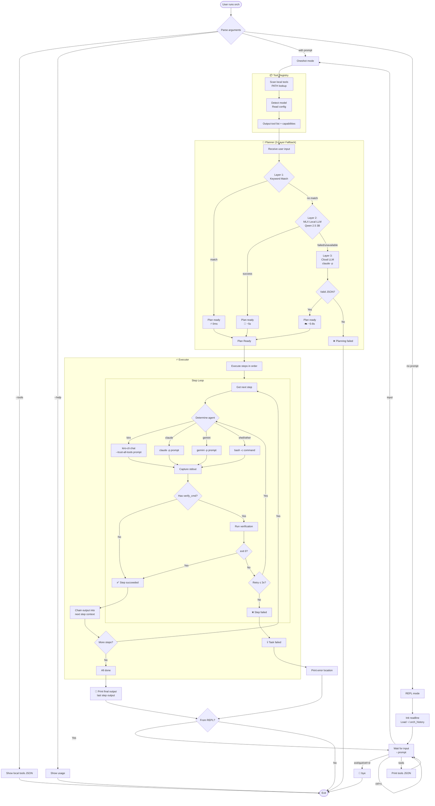
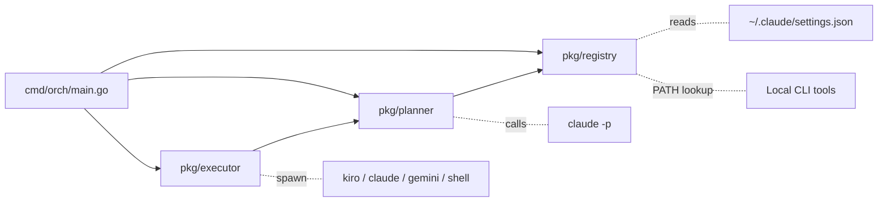
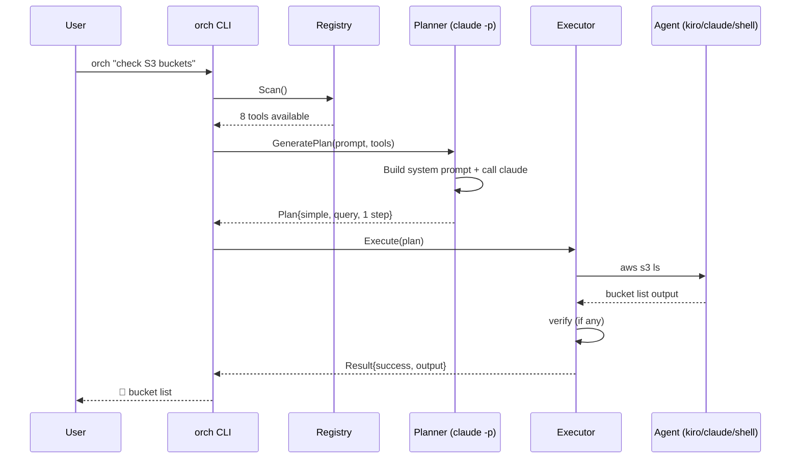

# Orch — Program Flow

## Overall Architecture Flowchart

```mermaid
flowchart TD
    %% ===== Entry =====
    Start([User runs orch]) --> ArgParse{Parse arguments}
    
    ArgParse -->|--tools| ShowTools[Show local tools JSON]
    ArgParse -->|--help| ShowHelp[Show usage]
    ArgParse -->|with prompt| Oneshot[Oneshot mode]
    ArgParse -->|no prompt| REPL[REPL mode]
    
    ShowTools --> End([Exit])
    ShowHelp --> End

    %% ===== REPL Loop =====
    REPL --> RLInit[Init readline<br/>Load ~/.orch_history]
    RLInit --> RLWait[Wait for input<br/>› prompt]
    RLWait -->|exit/quit/ctrl+d| Bye[👋 bye]
    RLWait -->|ctrl+c| RLWait
    RLWait -->|tools| ShowToolsInline[Print tools JSON] --> RLWait
    RLWait -->|input| Oneshot
    Bye --> End

    %% ===== Oneshot Core Flow =====
    Oneshot --> ScanReg

    subgraph Registry["📦 Tool Registry"]
        ScanReg[Scan local tools<br/>PATH lookup] --> DetectModel[Detect model<br/>Read config]
        DetectModel --> RegOut[Output tool list + capabilities]
    end

    RegOut --> PlanPhase

    subgraph Planner["🧠 Planner (3-Layer Fallback)"]
        PlanPhase[Receive user input] --> L1{Layer 1:<br/>Keyword Match}
        L1 -->|match| PlanReady[Plan ready<br/>⚡ 0ms]
        L1 -->|no match| L2{Layer 2:<br/>MLX Local LLM<br/>Qwen 2.5 3B}
        L2 -->|success| PlanReady2[Plan ready<br/>🍎 ~5s]
        L2 -->|failed/unavailable| L3[Layer 3:<br/>Cloud LLM<br/>claude -p]
        L3 --> ValidatePlan{Valid JSON?}
        ValidatePlan -->|Yes| PlanReady3[Plan ready<br/>☁️ ~5-8s]
        ValidatePlan -->|No| PlanFail[❌ Planning failed]
        PlanReady2 --> ExecReady[Plan Ready]
        PlanReady --> ExecReady
        PlanReady3 --> ExecReady
    end

    PlanFail --> End
    ExecReady --> ExecPhase

    subgraph Executor["⚡ Executor"]
        ExecPhase[Execute steps in order] --> StepLoop

        subgraph StepLoop["Step Loop"]
            direction TB
            NextStep[Get next step] --> RouteAgent{Determine agent}
            RouteAgent -->|kiro| RunKiro[kiro-cli chat<br/>--trust-all-tools prompt]
            RouteAgent -->|claude| RunClaude[claude -p prompt]
            RouteAgent -->|gemini| RunGemini[gemini -p prompt]
            RouteAgent -->|shell/other| RunShell[bash -c command]
            
            RunKiro --> Capture[Capture stdout]
            RunClaude --> Capture
            RunGemini --> Capture
            RunShell --> Capture
            
            Capture --> HasVerify{Has verify_cmd?}
            HasVerify -->|No| StepOK[✅ Step succeeded]
            HasVerify -->|Yes| RunVerify[Run verification]
            RunVerify --> VerifyResult{exit 0?}
            VerifyResult -->|Yes| StepOK
            VerifyResult -->|No| Retry{Retry ≤ 3x?}
            Retry -->|Yes| RouteAgent
            Retry -->|No| StepFail[❌ Step failed]
        end

        StepOK --> ChainCtx[Chain output into<br/>next step context]
        ChainCtx --> MoreSteps{More steps?}
        MoreSteps -->|Yes| NextStep
        MoreSteps -->|No| AllDone[All done]
        StepFail --> TaskFail[💀 Task failed]
    end

    %% ===== Results =====
    AllDone --> Report[🏁 Print final output<br/>last step output]
    TaskFail --> ReportErr[Print error location]
    
    Report --> BackToREPL{From REPL?}
    ReportErr --> BackToREPL
    BackToREPL -->|Yes| RLWait
    BackToREPL -->|No| End
```

## Module Dependencies

```mermaid
graph LR
    CMD[cmd/orch/main.go] --> REG[pkg/registry]
    CMD --> PLN[pkg/planner]
    CMD --> EXE[pkg/executor]
    PLN --> REG
    EXE --> PLN

    REG -.-|reads| CONF[~/.claude/settings.json]
    REG -.-|PATH lookup| BIN[Local CLI tools]
    PLN -.-|calls| CLAUDE[claude -p]
    EXE -.-|spawn| AGENTS[kiro / claude / gemini / shell]
```

## Data Flow

```mermaid
sequenceDiagram
    participant U as User
    participant O as orch CLI
    participant R as Registry
    participant P as Planner (claude -p)
    participant E as Executor
    participant A as Agent (kiro/claude/shell)

    U->>O: orch "check S3 buckets"
    O->>R: Scan()
    R-->>O: 8 tools available
    O->>P: GeneratePlan(prompt, tools)
    P->>P: Build system prompt + call claude
    P-->>O: Plan{simple, query, 1 step}
    O->>E: Execute(plan)
    E->>A: aws s3 ls
    A-->>E: bucket list output
    E->>E: verify (if any)
    E-->>O: Result{success, output}
    O-->>U: 🏁 bucket list
```
